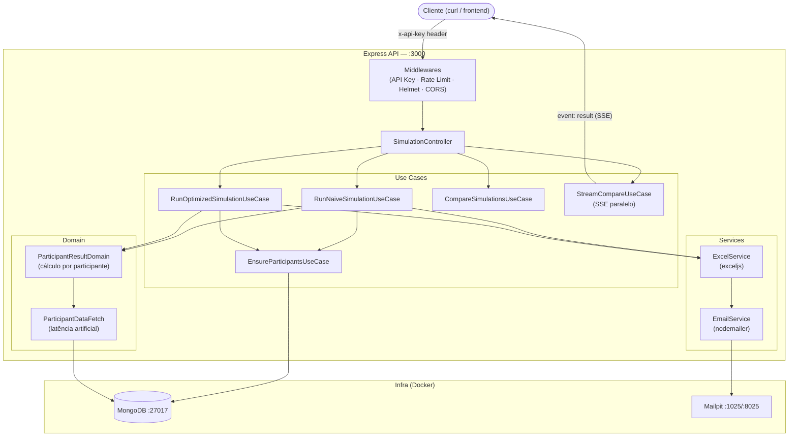

# Concurrency Lab

Simulação de um problema real de performance: processamento de N registros com dependência de múltiplas fontes de dados, comparando uma abordagem **sequencial em lotes fixos** ("naive") contra um **pool de concorrência dinâmico** ("otimizado").

Gera uma planilha Excel consolidada, envia por e-mail e documenta tudo via OpenAPI 3.1.

---

## Diagrama da Solução



**Naive** processa participantes em **lotes fixos sequenciais** com pausa entre lotes — tempo cresce em degraus.  
**Optimized** usa `p-limit` com pool de concorrência dinâmico — tempo cresce de forma linear e suave.  
**Stream** roda ambos em **paralelo real** e emite resultados via SSE conforme cada um termina.

---

## Stack

- **Node.js 20 + TypeScript**
- **MongoDB 7** via Docker
- **Express 4** + helmet + express-rate-limit
- **exceljs** — geração de planilhas
- **nodemailer** — envio de e-mail (Mailpit como SMTP local)
- **p-limit v3** — pool de concorrência controlado
- **Scalar** — documentação OpenAPI 3.1 interativa

---

## Pré-requisitos

- [Node.js 20+](https://nodejs.org)
- [Docker Desktop](https://www.docker.com/products/docker-desktop/)

---

## Como rodar

### Opção A — tudo via Docker (recomendado)

```bash
cp .env.example .env
# edite .env e defina API_KEY, CORS_ORIGIN, RATE_LIMIT_WINDOW_MS, RATE_LIMIT_MAX
docker compose up -d --build
```

Sobe MongoDB, Mailpit e o backend. Na primeira inicialização o seed é executado automaticamente.

**Re-executar o seed:**
```bash
docker exec concurrency-lab-backend rm /app/tmp/.seed-done
docker restart concurrency-lab-backend
```

### Opção B — backend local (dev)

```bash
# 1. Sobe apenas a infra
docker compose up -d mongo mailpit

# 2. Dependências
npm install

# 3. Variáveis de ambiente
cp .env.example .env
# edite .env com API_KEY, CORS_ORIGIN, RATE_LIMIT_WINDOW_MS, RATE_LIMIT_MAX

# 4. Seed
npm run seed

# 5. Servidor com hot-reload
npm run dev
```

Servidor disponível em `http://localhost:3000`.

---

## Segurança

Todas as rotas `/api/*` exigem o header `x-api-key` com o valor configurado em `API_KEY` no `.env`.

```bash
curl -X POST "http://localhost:3000/api/simulate/compare?count=20" \
  -H "x-api-key: dev-secret-change-me"
```

---

## Endpoints

| Método | Rota | Autenticação | Descrição |
|--------|------|:---:|-----------|
| `GET` | `/` | — | Healthcheck |
| `GET` | `/docs` | — | Documentação interativa (Scalar) |
| `GET` | `/openapi.json` | — | Spec OpenAPI 3.1 |
| `POST` | `/api/simulate/naive?count=N` | `x-api-key` | Simulação com lotes fixos |
| `POST` | `/api/simulate/optimized?count=N` | `x-api-key` | Simulação com pool de concorrência |
| `POST` | `/api/simulate/compare?count=N` | `x-api-key` | Compara os dois modos |
| `POST` | `/api/simulate/compare/stream?count=N` | `x-api-key` | Comparação em tempo real (SSE) |

`count`: quantidade de participantes (padrão: 20, máximo: 500).

---

## Stream SSE (`/compare/stream`)

Roda naive e optimized em **paralelo real** e emite três eventos via Server-Sent Events:

```
event: result
data: { "event": "result", "at": "...", "payload": { "mode": "optimized", ... } }

event: result
data: { "event": "result", "at": "...", "payload": { "mode": "naive", ... } }

event: summary
data: { "event": "summary", "at": "...", "payload": { "speedup": "8.49x", ... } }
```

```bash
curl -N -X POST "http://localhost:3000/api/simulate/compare/stream?count=20" \
  -H "x-api-key: dev-secret-change-me"
```

---

## Ver e-mails enviados

O projeto usa **Mailpit** como servidor SMTP local. Ele **intercepta** os e-mails e os exibe em uma caixa de entrada web — nenhum e-mail é entregue a destinatários reais.

Acesse `http://localhost:8025` para visualizar os e-mails capturados com o anexo Excel.

> **Quer receber e-mails de verdade?**  
> Configure um SMTP real no `.env`:
> ```env
> SMTP_HOST=smtp.gmail.com
> SMTP_PORT=587
> SMTP_USER=seuemail@gmail.com
> SMTP_PASS=sua-app-password
> ```

---

## Resultados observados

| count | naive (ms) | otimizado (ms) | speedup |
|-------|-----------|----------------|---------|
| 10    | ~3.100    | ~450           | ~6.9x   |
| 20    | ~6.200    | ~600           | ~10.3x  |
| 40    | ~12.400   | ~950           | ~13x    |
| 80    | ~24.800   | ~1.700         | ~14.6x  |

A curva do naive cresce em **degraus** por causa das pausas fixas entre lotes. A otimizada cresce de forma quase linear e suave.

---

## Estrutura de pastas

```
src/
├── config/           # env.ts (config tipada), database.ts, dtos/, env-parsers/
├── controllers/      # simulation-controller.ts
├── data-access/      # participant-data-fetch.ts (latência artificial)
├── docs/             # openapi-spec.ts, docs-page.ts
├── domain/           # participant-result.ts, calculation-mode.ts, email-config.ts, …
├── dtos/             # contratos HTTP + SSE envelope
├── middlewares/      # validate-api-key, validate-count-query, error-handler, not-found-handler
├── models/           # participant, income-source, dependent (Mongoose)
├── routes/           # simulation-routes.ts
├── seed/             # run-seed.ts
├── services/         # excel-service.ts, email-service.ts
├── types/            # generic-types.ts, simulation-types.ts
├── use-cases/        # ensure-participants, run-naive, run-optimized, compare, stream-compare
├── utils/            # logger, number, string, boolean, array, object, json, date, stopwatch
├── app.ts
└── server.ts
```
